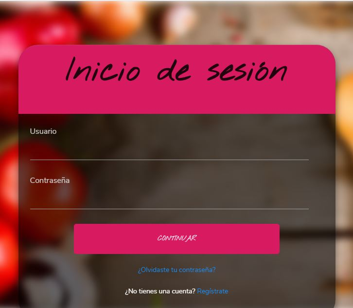
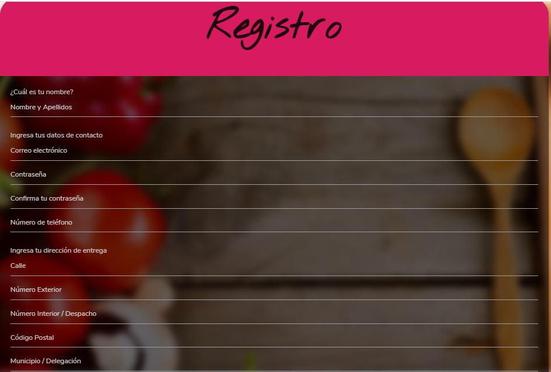
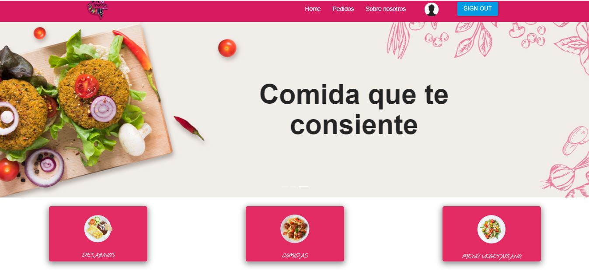
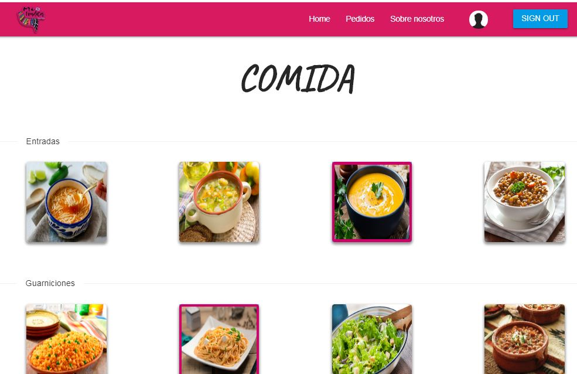
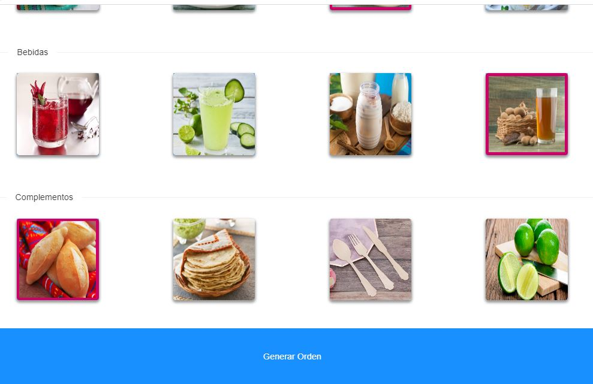
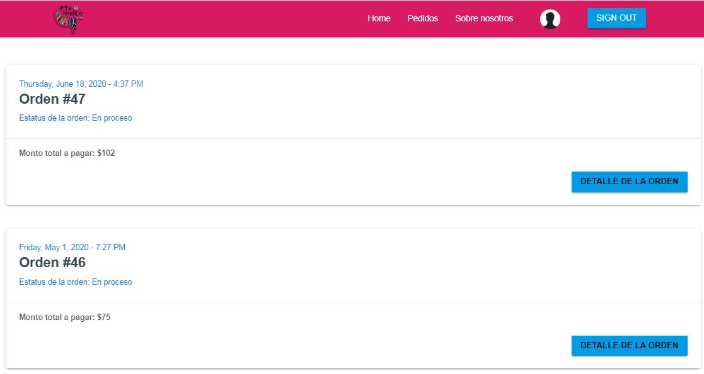
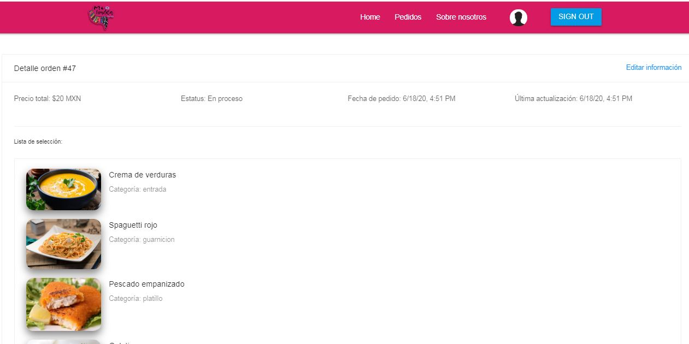
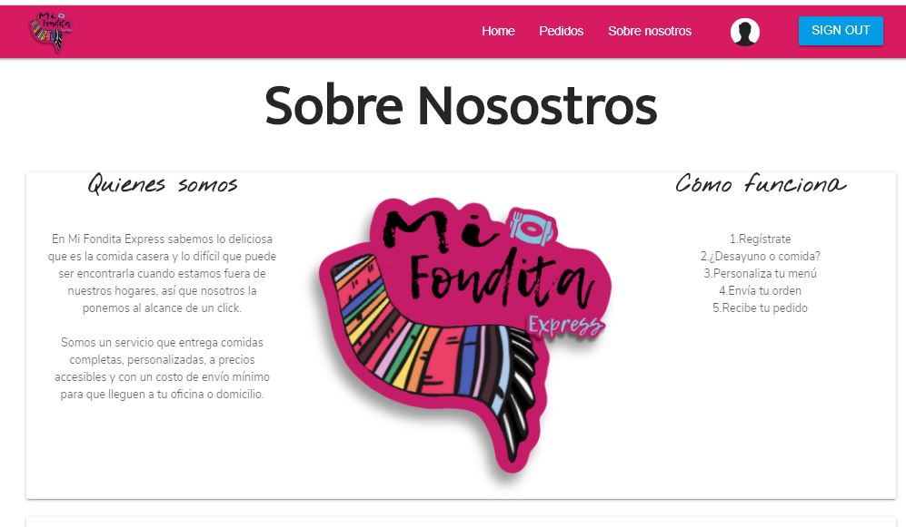

# Mi Fondita Express v2

## Overview

* This project is a copy of the original group project where you can check the commit history and the different versions
* Second version of the Full Stack application now developed with React.js, Bootstrap, CSS and Materialize in the front end and Node.js, Express.js, Sequilize.js and MySQL database
* It's a new prototype where the app now has a login and registration form for new users where Firebase saves the password and can use a Google account to enter to the app
* When user has signed in can select different menu options and create the order

## Technologies used to develop the app

- HTML5
- CSS3
- Bootstrap
- Materialize
- React.js
- Javascript
- JSON
- Axios
- Express.js
- Node.js
- MySQL DB
- Sequilize.js
- Firebase

## Group Project
https://github.com/alfa9317/MexFood-App

## App Link
https://mi-fondita-express.herokuapp.com/login

## Authors

* Lesly Sanchez
* Francisco Silva
* Alejandro Vilchis
* Jose Alfredo Torres